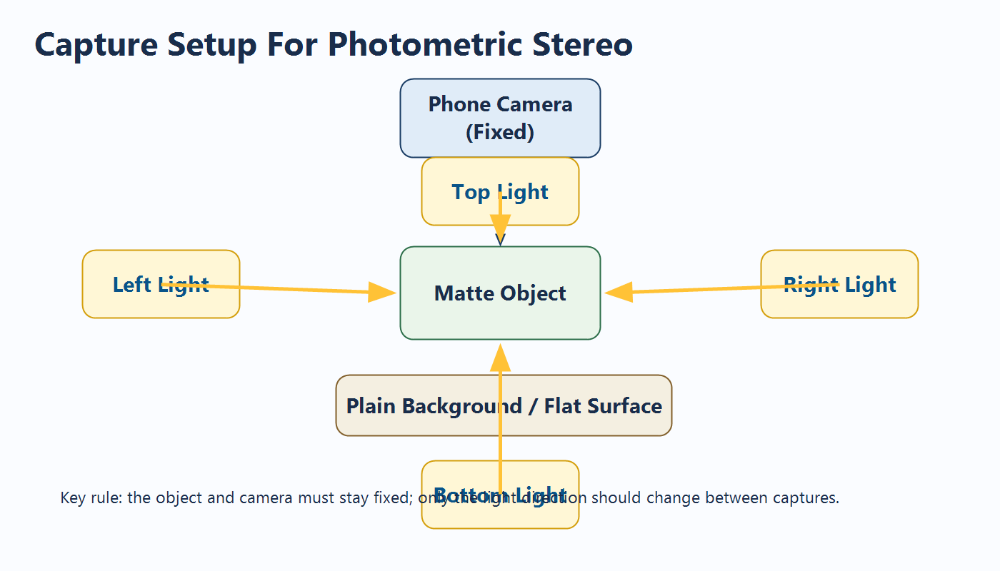
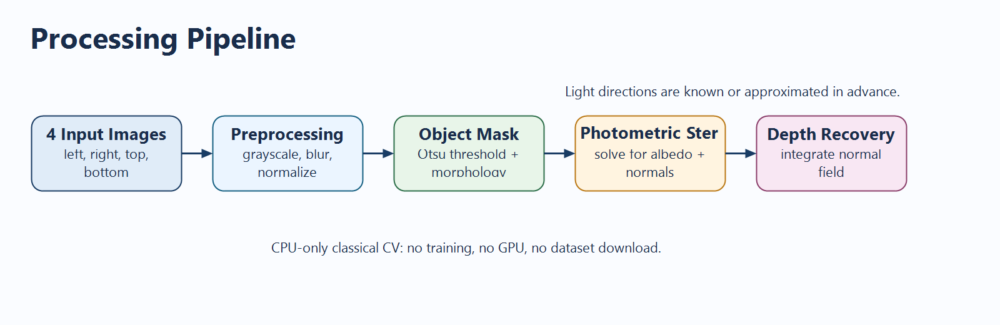

# Low-Cost 3D Surface Reconstruction Using Photometric Stereo

## Overview

This repository presents a lightweight computer vision project that reconstructs the surface characteristics of a small object using four images captured under different lighting directions. The method is based on **photometric stereo**, making the project directly relevant to the **Shape From X** portion of a Computer Vision syllabus.

The project is designed to be:

- technically strong
- unique compared to common classroom submissions
- CPU-friendly
- free from deep learning and large dataset requirements

## Key Idea

The same object is photographed multiple times while the camera remains fixed and the light direction changes. From these images, the system estimates:

- foreground mask
- albedo map
- surface normal map
- approximate depth map
- relit preview

This produces an interpretable 3D-like reconstruction without requiring a GPU or model training.

## Visual Summary

### Capture Setup



### Processing Pipeline



## Why This Project Stands Out

- It uses **photometric stereo**, which is less commonly chosen than face detection, tracking, or object detection.
- It is grounded in image formation and reflectance theory rather than a black-box pretrained model.
- It gives visually strong outputs with minimal computation.
- It maps well to advanced syllabus topics.

## Syllabus Relevance

- **Module 1**: image formation, filtering, image enhancement, intensity normalization
- **Module 3**: segmentation and object extraction
- **Module 5**: light at surfaces, albedo estimation, photometric stereo, shape from light

## Repository Structure

```text
.
|-- README.md
|-- PROJECT_REPORT.docx
|-- PROJECT_REPORT.md
|-- pocket_photometric_stereo/
|   |-- run_photometric_stereo.py
|   |-- requirements.txt
|   |-- lights_example.json
|   |-- README.md
|   |-- sample_input/
|   `-- output/
`-- report_assets/
    |-- capture_setup.png
    |-- pipeline_overview.png
    `-- outputs_overview.png
```

## Quick Start

Move into the project folder and install dependencies:

```bash
cd pocket_photometric_stereo
pip install -r requirements.txt
```

Add four aligned images of the same object to `sample_input`:

- `left.jpg`
- `right.jpg`
- `top.jpg`
- `bottom.jpg`

Then run:

```bash
python run_photometric_stereo.py --input-dir sample_input --output-dir output
```

Optional faster run:

```bash
python run_photometric_stereo.py --input-dir sample_input --output-dir output --resize-width 640
```

## Recommended Input Objects

- coin
- leaf
- clay model
- embossed paper
- carved eraser
- textured keychain

Avoid:

- transparent objects
- mirror-like objects
- highly reflective metal

## Main Outputs

The program generates:

- `01_mean_input.png`
- `02_mask.png`
- `03_albedo.png`
- `04_normal_map.png`
- `05_depth_map.png`
- `06_relit_preview.png`
- `summary.json`

## Documentation

- Official report: [PROJECT_REPORT.docx](PROJECT_REPORT.docx)
- Markdown report source: [PROJECT_REPORT.md](PROJECT_REPORT.md)
- Implementation details: [pocket_photometric_stereo/README.md](pocket_photometric_stereo/README.md)

## Technology Stack

- Python
- NumPy
- OpenCV

## Limitations

- Works best on matte surfaces.
- Assumes a fixed camera and fixed object position.
- Sensitive to strong shadows and harsh ambient lighting.
- Produces approximate depth rather than exact metric 3D geometry.

## References

1. Richard Szeliski, *Computer Vision: Algorithms and Applications*, Springer, 2011.
2. D. A. Forsyth and J. Ponce, *Computer Vision: A Modern Approach*, Pearson, 2003.
3. R. Hartley and A. Zisserman, *Multiple View Geometry in Computer Vision*, Cambridge University Press, 2004.
